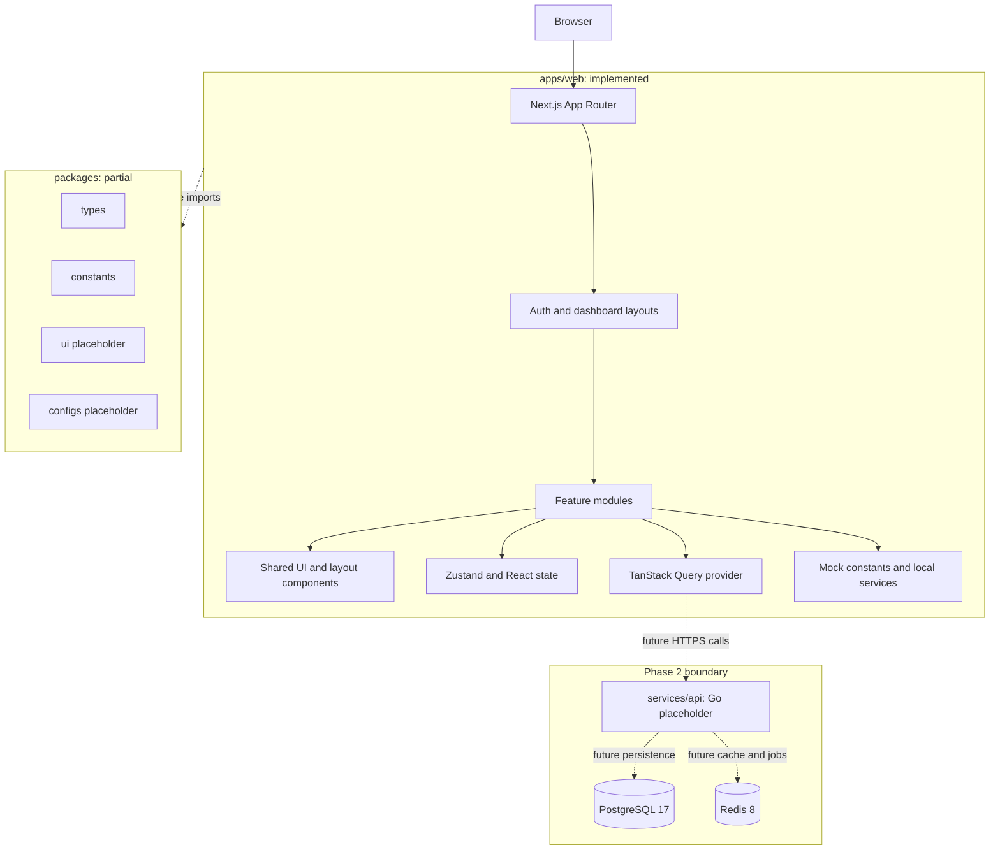
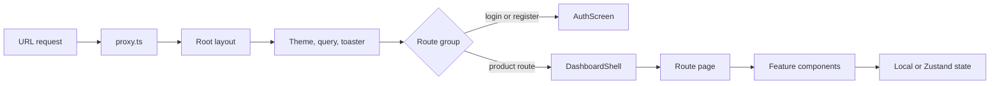
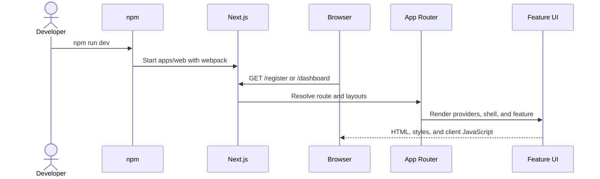
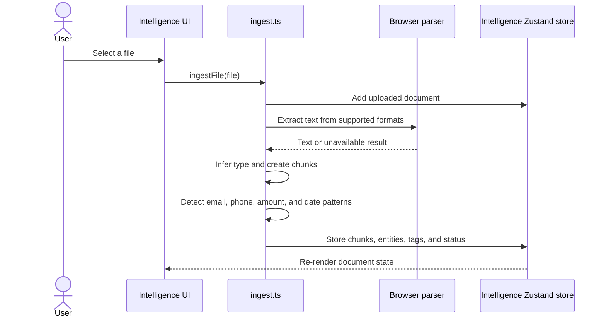
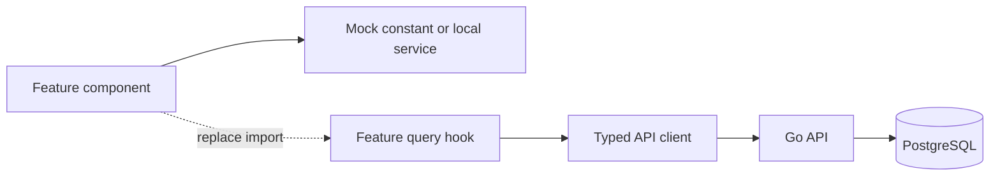
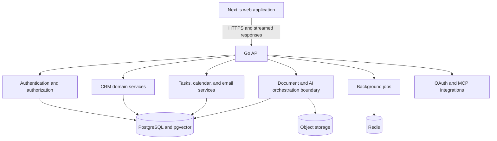

# Build and understand Orion OS

Orion OS is an AI-focused customer relationship management (CRM) and productivity interface. This README explains what runs today, how to develop it, how requests and state flow through the code, and how the repository can grow into its planned service architecture.

> Current status: the Next.js web application runs with local and mock data. Authentication enforcement, persistent backend operations, OAuth synchronization, and AI service calls remain planned work. The Go service contains a Phase 2 placeholder, while Docker Compose can start PostgreSQL and Redis for backend development.

## See the interface

<div align="center">
  
</div>

The authentication experience uses the Orion space background, the full brand logo, and a transparent liquid-glass form. Both `/login` and `/register` render the shared auth component.

## Understand what works today

The current implementation supports these product surfaces:

- `/dashboard`: dashboard widgets backed by local mock data
- `/tasks`: interactive task management stored in React state
- `/calendar`: interactive calendar views with mock scheduling data
- `/emails`: local compose and email interactions
- `/habits`: habit and focus tracking interface
- `/analytics`: mock productivity and team insights
- `/ai`: Nova assistant and connector interface in mock mode
- `/connectors`: connector and Model Context Protocol (MCP) server catalog
- `/intelligence`: local document ingestion, chunking, entity detection, search, and document details
- `/notifications`: notification management interface
- `/settings`: workspace settings interface
- `/login` and `/register`: shared responsive authentication interface

The root route redirects to `/dashboard`. `apps/web/proxy.ts` currently permits every route, so dashboard routes do not require a session yet.

## Architecture at a glance

Orion uses an npm workspace monorepo. The Next.js application is the only complete runtime today. The Go application and data services define the next backend boundary.


```mermaid
flowchart TB
    Browser[Browser]

    subgraph Web[apps/web: implemented]
        Router[Next.js App Router]
        Layouts[Auth and dashboard layouts]
        Features[Feature modules]
        Shared[Shared UI and layout components]
        ClientState[Zustand and React state]
        Query[TanStack Query provider]
        Mocks[Mock constants and local services]
    end

    subgraph SharedPackages[packages: partial]
        Types[types]
        Constants[constants]
        UI[ui placeholder]
        Configs[configs placeholder]
    end

    subgraph PlannedBackend[Phase 2 boundary]
        API[services/api: Go placeholder]
        Postgres[(PostgreSQL 17)]
        Redis[(Redis 8)]
    end

    Browser --> Router
    Router --> Layouts
    Layouts --> Features
    Features --> Shared
    Features --> ClientState
    Features --> Query
    Features --> Mocks
    Web -. type imports .-> SharedPackages
    Query -. future HTTPS calls .-> API
    API -. future persistence .-> Postgres
    API -. future cache and jobs .-> Redis
```

Solid arrows show active runtime relationships. Dotted arrows show partial or planned boundaries.

## Repository ownership

Each top-level directory has one architectural role:

```text
orion-os/
├── apps/
│   └── web/                         # Next.js application
│       ├── app/                     # Routes, layouts, and route composition
│       │   ├── (auth)/              # Login and registration routes
│       │   └── (dashboard)/         # Dashboard shell and product routes
│       ├── features/                # Feature-owned UI, state, data, and services
│       ├── providers/               # Theme, query, and toast providers
│       ├── public/                  # Browser-served images and icons
│       ├── shared/                  # Cross-feature components, utilities, and types
│       └── store/                   # Global application shell state
├── packages/
│   ├── configs/                     # Reserved shared configuration package
│   ├── constants/                   # Cross-workspace constants
│   ├── types/                       # Cross-workspace type exports
│   └── ui/                          # Reserved shared UI package
├── services/
│   └── api/                         # Phase 2 Go service placeholder
├── infrastructure/
│   └── docker-compose.yml           # PostgreSQL and Redis development services
├── docs/                            # Architecture, design, connectors, and blueprints
├── scripts/                         # Repository automation
├── package.json                     # Workspace scripts and package boundaries
└── README.md                        # Runtime, workflow, and architecture guide
```

Use these ownership rules when adding code:

- Put route entry points and layouts in `apps/web/app`
- Put feature behavior in `apps/web/features/<feature>`
- Put reusable application UI in `apps/web/shared`
- Put global shell state in `apps/web/store`
- Export a feature’s supported surface from its `index.ts`
- Avoid importing another feature’s private files
- Move code into `packages/*` only when more than one workspace needs it
- Add persistent business logic behind `services/api`, not inside page components

## Web application architecture

The web application separates route composition from feature implementation. App Router pages choose the feature to render, while feature directories own components, types, constants, local services, and feature state.


```mermaid
flowchart LR
    Request[URL request]
    Proxy[proxy.ts]
    Root[Root layout]
    Providers[Theme, query, toaster]
    RouteGroup{Route group}
    Auth[AuthScreen]
    Shell[DashboardShell]
    Page[Route page]
    Feature[Feature components]
    State[Local or Zustand state]

    Request --> Proxy
    Proxy --> Root
    Root --> Providers
    Providers --> RouteGroup
    RouteGroup -->|login or register| Auth
    RouteGroup -->|product route| Shell
    Shell --> Page
    Page --> Feature
    Feature --> State
```

### Root providers

`apps/web/app/layout.tsx` loads fonts, global CSS, and `Providers`. The provider tree contains:

- `ThemeProvider`: sets the `data-theme` attribute and defaults to dark mode
- `QueryProvider`: creates one TanStack Query client per browser session
- `Toaster`: renders Sonner notifications with Orion glass styling

TanStack Query currently establishes the client-side server-state boundary. Most feature pages still use local constants and React or Zustand state.

### Dashboard shell

`apps/web/app/(dashboard)/layout.tsx` wraps every product route in `DashboardShell`. The shell owns the sidebar, header, scrollable content area, bottom dock, command palette, notification panel, ambient background, and liquid-glass cockpit surface.

The global Zustand store in `apps/web/store/app-store.ts` controls:

- Sidebar visibility and collapsed state
- Command palette visibility
- Notification panel visibility

Keep domain data out of this store. Feature data belongs inside its feature directory or a backend query cache.

### Authentication screens

Both auth routes render `apps/web/features/auth/components/auth-screen.tsx`:

```mermaid
flowchart LR
    Login[/login] --> Shared[AuthScreen]
    Register[/register] --> Shared
    Shared --> Brand[orion-logo-full.png]
    Shared --> Background[orion-auth-bg.png]
    Shared --> Form[Local form interactions]
    Form --> Switch[Login and register links]
    Form -. planned .-> AuthAPI[Authentication API]
```

The current form prevents native submission and does not create a session. Password visibility and route switching work in the browser. Add validation, authentication requests, session cookies, and protected-route checks when the API is implemented.

### Feature modules

A feature may contain these folders:

```text
features/example/
├── components/                      # Feature-specific React components
├── constants/                       # Static and mock data
├── services/                        # Local processing or API clients
├── store/                           # Feature-scoped Zustand state
├── types.ts                         # Feature domain types
└── index.ts                         # Supported imports for other modules
```

Not every feature needs every folder. Add a folder after the feature has code that belongs there.

## Runtime workflows

These workflows describe the behavior in the current code.

### Start and render the application


```mermaid
sequenceDiagram
    actor Developer
    participant npm
    participant Next as Next.js
    participant Browser
    participant Route as App Router
    participant UI as Feature UI

    Developer->>npm: npm run dev
    npm->>Next: Start apps/web with webpack
    Browser->>Next: GET /register or /dashboard
    Next->>Route: Resolve route and layouts
    Route->>UI: Render providers, shell, and feature
    UI-->>Browser: HTML, styles, and client JavaScript
```

The root workspace forwards `npm run dev` to `apps/web`. The web workspace runs `next dev --webpack` on port `3000` unless you pass another port.

### Navigate through an auth route

1. Open `/register` or `/login`
2. Next.js renders the `(auth)` layout
3. The route passes `register` or `login` mode to `AuthScreen`
4. `AuthScreen` selects the matching fields and copy
5. Client state controls password visibility
6. The footer link changes to the other auth route
7. Submission stops at the client until authentication endpoints exist

### Render a dashboard route

1. Open a route such as `/tasks`
2. The proxy permits the request without a session check
3. The dashboard layout renders `DashboardShell`
4. The shell renders navigation and global overlays once
5. The route page renders inside the shell’s scrollable main region
6. The page imports feature components or feature-owned data
7. Interactions update local React state or a feature Zustand store

### Ingest a document locally

The intelligence feature contains the most complete local processing pipeline:


```mermaid
sequenceDiagram
    actor User
    participant UI as Intelligence UI
    participant Ingest as ingest.ts
    participant Parser as Browser parser
    participant Store as Intelligence Zustand store

    User->>UI: Select a file
    UI->>Ingest: ingestFile(file)
    Ingest->>Store: Add uploaded document
    Ingest->>Parser: Extract text from supported formats
    Parser-->>Ingest: Text or unavailable result
    Ingest->>Ingest: Infer type and create chunks
    Ingest->>Ingest: Detect email, phone, amount, and date patterns
    Ingest->>Store: Store chunks, entities, tags, and status
    Store-->>UI: Re-render document state
```

Text, Markdown, comma-separated values (CSV), JSON, logs, and text MIME types use `File.text()`. Microsoft Word `.docx` files load Mammoth dynamically. Unsupported binary formats use simulated demo chunks. Timers model scanning, processing, and indexing states; no file reaches a server.

### Use mock feature data

Dashboard, task, calendar, email, analytics, AI, connector, and intelligence screens import feature-owned constants. Mutations affect browser memory and reset after a reload unless a component adds its own persistence.

Replace mock data through this path:


```mermaid
flowchart LR
    Component[Feature component]
    Mock[Mock constant or local service]
    Query[Feature query hook]
    Client[Typed API client]
    API[Go API]
    Database[(PostgreSQL)]

    Component --> Mock
    Component -. replace import .-> Query
    Query --> Client
    Client --> API
    API --> Database
```

Keep the component contract stable during this change. Loading, empty, error, and optimistic states should live in the feature UI or query hook.

## Target backend architecture

The target architecture keeps the Next.js application as the client and moves persistent business rules into the Go API. PostgreSQL stores durable records, while Redis supports caching, rate limits, pub/sub, and background work.


```mermaid
flowchart TB
    Web[Next.js web application]
    API[Go API]
    Auth[Authentication and authorization]
    CRM[CRM domain services]
    Productivity[Tasks, calendar, and email services]
    Intelligence[Document and AI orchestration boundary]
    Jobs[Background jobs]
    Postgres[(PostgreSQL and pgvector)]
    Redis[(Redis)]
    Objects[(Object storage)]
    External[OAuth and MCP integrations]

    Web -->|HTTPS and streamed responses| API
    API --> Auth
    API --> CRM
    API --> Productivity
    API --> Intelligence
    API --> Jobs
    Auth --> Postgres
    CRM --> Postgres
    Productivity --> Postgres
    Intelligence --> Postgres
    Intelligence --> Objects
    Jobs --> Redis
    API --> External
```

This diagram is a target, not the current runtime. `services/api/main.go` does not start an HTTP server yet, and the repository does not contain an AI service or object-storage adapter.

### Planned request lifecycle

The backend should use this request lifecycle once implemented:

1. The web client sends an authenticated HTTPS request
2. Middleware validates the session, workspace, role, and request limits
3. A handler validates the request payload
4. A domain service applies business rules
5. A repository reads or writes PostgreSQL
6. Redis handles cache entries, rate limits, or queued work when needed
7. The handler returns a typed response or starts a documented stream
8. TanStack Query updates or invalidates the client cache
9. The feature renders success, empty, loading, or error state

Do not place authorization only in the web proxy. The API must verify authorization for every protected operation.

## Set up the repository

You need Node.js 20 or newer and npm. Install Docker and Go only when working on the planned backend.

### Install dependencies

Run this command from the repository root:

```powershell
npm install
```

npm installs the root workspace and `apps/web` dependencies from the shared lockfile.

### Start the web application

Start Next.js from the repository root:

```powershell
npm run dev
```

Open these routes:

- Sign up: `http://localhost:3000/register`
- Sign in: `http://localhost:3000/login`
- Dashboard: `http://localhost:3000/dashboard`

Pass a port when `3000` is occupied:

```powershell
npm run dev --workspace=apps/web -- --port 3005
```

### Build and check the web application

Run the production build:

```powershell
npm run build
```

Run ESLint:

```powershell
npm run lint
```

Start a completed production build:

```powershell
npm run start --workspace=apps/web
```

### Start PostgreSQL and Redis

The `phase-2` Compose profile starts local data services:

```powershell
docker compose --profile phase-2 -f infrastructure/docker-compose.yml up -d
```

Inspect the containers:

```powershell
docker compose -f infrastructure/docker-compose.yml ps
```

Stop them without deleting data:

```powershell
docker compose --profile phase-2 -f infrastructure/docker-compose.yml down
```

Development defaults are:

| Service | Address | Credentials |
|---|---|---|
| PostgreSQL | `localhost:5432` | Database `orion`, user `orion`, password `orion_local` |
| Redis | `localhost:6379` | No password in the Compose file |

These credentials are for local development. Use secret-managed credentials in deployed environments.

## Environment configuration

The current web interface does not require environment variables. `packages/constants` reads `NEXT_PUBLIC_API_URL` and falls back to `http://localhost:8080`, but no current feature calls that API.

Use these variables when implementing the backend integration:

| Variable | Exposure | Purpose |
|---|---|---|
| `NEXT_PUBLIC_APP_URL` | Browser | Canonical web origin |
| `NEXT_PUBLIC_API_URL` | Browser | Public API base URL |
| `DATABASE_URL` | Server | PostgreSQL connection string |
| `REDIS_URL` | Server | Redis connection string |
| `API_JWT_SECRET` | Server | Token signing or verification secret |
| OAuth provider variables | Server | Provider credentials and callback configuration |
| Model provider keys | Server | AI model access |

Never expose secrets through a variable prefixed with `NEXT_PUBLIC_`.

## Development workflow

Use this sequence for a feature change:

1. Identify the owning route and feature directory
2. Read the feature’s `index.ts`, types, constants, and existing components
3. Keep route files focused on composition
4. Add behavior inside the owning feature
5. Reuse shared components only for cross-feature patterns
6. Check keyboard, focus, loading, empty, error, and responsive states
7. Run targeted lint while iterating
8. Run the production build before handing off the change
9. Record planned backend work instead of simulating persistence invisibly

### Add a route

Create the page under the appropriate route group:

- Public auth route: `apps/web/app/(auth)/<route>/page.tsx`
- Dashboard route: `apps/web/app/(dashboard)/<route>/page.tsx`

Export the page as the default component. Put reusable behavior in `apps/web/features/<feature>`.

### Add a feature

1. Create `apps/web/features/<feature>`
2. Add domain types and constants
3. Add components and local services
4. Add feature state only when component state is insufficient
5. Export the supported API from `index.ts`
6. Compose the feature from an App Router page

### Add an API-backed operation

1. Define request and response types
2. Add a feature-owned API client or query hook
3. Add the matching Go handler and domain service
4. Validate authentication and workspace access in the API
5. Add repository operations and migrations
6. Replace the mock import without changing the page contract
7. Test success, validation failure, authorization failure, and network failure

## State and data rules

Choose state by lifetime and ownership:

| State type | Location | Examples |
|---|---|---|
| Component interaction | React state | Selected row, open composer, password visibility |
| Global shell state | `apps/web/store` | Sidebar, command palette, notification panel |
| Feature client state | Feature store | Intelligence documents and chunks |
| Server state | TanStack Query | Future tasks, contacts, deals, and settings requests |
| Durable records | PostgreSQL | Future users, workspaces, CRM records, and task data |
| Cache or background state | Redis | Future rate limits, jobs, and pub/sub |

Do not duplicate server records in a global Zustand store after API integration. TanStack Query should own remote cache state.

## Design and accessibility architecture

`apps/web/app/globals.css` defines Tailwind theme tokens and global glass surfaces. Feature-specific CSS Modules may implement isolated visual systems, as the auth screen does.

Follow these constraints:

- Use semantic color and spacing tokens for shared product UI
- Keep text contrast readable over glass backgrounds
- Expose labels for every input and accessible names for icon buttons
- Preserve visible focus styles
- Respect `prefers-reduced-motion`
- Keep touch controls at usable sizes on phone layouts
- Verify reflow without horizontal page scrolling

Read [the design system](docs/DESIGN_SYSTEM.md) for component and accessibility requirements.

## Testing and verification

The repository currently defines build and lint scripts but does not contain a committed automated test suite. Use these checks for every change:

```powershell
npm run lint
npm run build
```

For UI work, verify these viewport widths manually or with Playwright tooling:

- `390px`: phone
- `768px`: tablet
- `1024px`: compact desktop
- `1440px`: desktop

Test route navigation, keyboard operation, focus visibility, form controls, overflow, and console errors. Add Vitest, Testing Library, and Playwright configuration before treating unit and end-to-end tests as repository commands.

## Deployment boundaries

Deploy `apps/web` as a Next.js application. Build it from the repository root so npm resolves workspace dependencies through the root lockfile.

Deploy the planned Go API separately after it exposes a real server, health endpoint, configuration validation, database migrations, and graceful shutdown. Run PostgreSQL and Redis as managed services outside local development.

Before production deployment:

- Implement session creation and protected-route enforcement
- Enforce authorization inside the API
- Replace local mock mutations with typed API operations
- Add schema migrations, backups, and restore procedures
- Store secrets in the deployment platform
- Add structured logs, metrics, traces, and alerts
- Add automated unit, integration, and end-to-end checks
- Review content security policy, cross-origin resource sharing, cookie, and rate-limit settings

## Troubleshoot development

### Port 3000 is occupied

Find the listening process in PowerShell:

```powershell
Get-NetTCPConnection -LocalPort 3000 -State Listen
```

Run Orion on another port if that process must stay active:

```powershell
npm run dev --workspace=apps/web -- --port 3005
```

### The UI shows old styles

Confirm that the running process uses this repository, then refresh without the browser cache. Stop duplicate Next.js processes when multiple projects use nearby ports.

### A dashboard route opens without signing in

This is current Phase 1 behavior. `apps/web/proxy.ts` allows all requests. Implement session checks in both the proxy and API before relying on protected routes.

### Data disappears after a reload

Most current feature interactions use browser memory. Persistent writes require the planned API and database integration.

### PostgreSQL or Redis does not start

Confirm Docker is running and inspect profile containers:

```powershell
docker compose --profile phase-2 -f infrastructure/docker-compose.yml ps
```

Check whether another process uses ports `5432` or `6379` before changing the Compose file.

## Read deeper design documents

Use these documents for more detail:

- [Architecture notes](docs/ARCHITECTURE.md)
- [AI connector architecture](docs/AI_CONNECTORS.md)
- [Design system](docs/DESIGN_SYSTEM.md)
- [Intelligence Hub blueprint](docs/intelligence-hub-blueprint.md)

## Current limitations

The current repository has these explicit limitations:

- Auth forms do not create accounts or sessions
- Dashboard routes are not protected
- The Go API has no HTTP implementation
- PostgreSQL and Redis are not connected to application code
- AI and connector screens do not call external systems
- Most product data resets after reload
- The document pipeline runs locally and simulates unsupported binary extraction
- Automated test commands are not configured

Treat these items as architecture work, not production-ready behavior.

## License

This repository is private and proprietary unless its owners add a separate license file.
